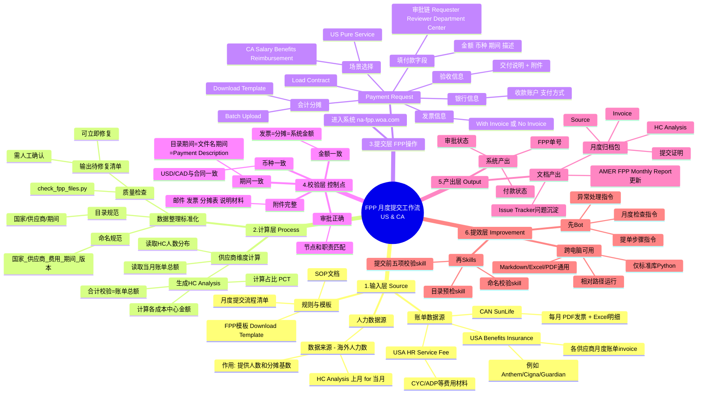

# FPP 工作流思维导图（US & CA，新手友好版）

> 目标：让第一次接触 FPP 的同事也能看懂“材料是什么、怎么做、最后交什么”。

## 一、先懂 8 个核心概念（小白必读）

1. `FPP`：付款申请系统，最终要在这里发起并提交 Payment Request。  
2. `Vendor`：供应商，比如 Anthem、Cigna、SunLife。  
3. `Invoice`：供应商发票/账单，是付款金额依据。  
4. `HC`（Headcount）：人数数据，是分摊比例依据。  
5. `HC Analysis`：把“人数 + 账单总额”算成“各实体金额”的计算表。  
6. `Cost Center`：成本中心，钱最终分到哪个组织单元。  
7. `Batch Upload`：在 FPP 批量导入会计分摊数据。  
8. `Issue Tracker`：月报里记录异常和修复动作的台账。

---

## 二、你最关心的 4 个目录，到底是什么

## 1) `USA/Benefits Insurance`

- 是美国福利保险费用池（医疗、牙科、视力、寿险等）。
- 每家供应商每个月至少有：
  - `月度账单invoice`（PDF 发票）
  - `HC Analysis`（Excel 分摊表）
- 用途：支撑“福利类付款申请”。

## 2) `USA/HR Service Fee`

- 是美国 HR 服务费费用池（非保险类）。
- 典型内容：平台费、管理费、通勤福利费等账单和支持文件。
- 用途：支撑“HR 运营服务类付款申请”。

## 3) `数据来源 - 海外人力数/*`

- 是分摊基数来源，不是账单来源。
- 提供每个实体/部门/成本中心的人数。
- 用途：算分摊比例（PCT）。

## 4) `USA/CAN vendor 的 HC Analysis`

- 是中间计算结果，不是最终提交系统。
- 核心产出：各实体/成本中心应承担金额。
- 用途：导入 FPP 会计分摊模板，支持审批解释。

---

## 三、完整工作流思维导图（可视化）

---

## 四、按“输入 → 操作 → 产出”看全流程（一步一步）

## 第 0 步：准备期（每月开始）

- 输入：本期月份（例如 `202606`）、提单截止时间。
- 操作：
  - 新建当月目录；
  - 通知接口人提交当月发票和 HC 数据。
- 产出：当月工作空间准备完成。

## 第 1 步：收材料（Source）

- 输入：
  - 供应商发票（PDF）
  - HC 数据（Excel）
  - 历史月报（用于对比）
- 操作：
  - 按国家/供应商/月份归档；
  - 统一命名（国家_供应商_费用_期间_版本）。
- 产出：完整可追溯的源材料目录。

## 第 2 步：跑预检查（质量门禁）

- 输入：本月目录。
- 操作：
  - 执行  
    `python3 check_fpp_files.py --root . --fix-report ./待修复清单.md`
  - 先处理“可立即修复”（改名/建目录）；
  - 再处理“需人工确认”（期间错位、缺关键文件）。
- 产出：
  - `待修复清单.md`
  - 目录规范化完成。

## 第 3 步：做分摊（Process）

- 输入：
  - 发票总额
  - HC 人数分布
- 操作：
  - 计算各实体人数占比（PCT）；
  - 计算各成本中心金额；
  - 做合计校验（分摊合计=账单总额）。
- 产出：供应商 `HC Analysis` 结果表。

## 第 4 步：填 FPP（Submit）

- 输入：
  - 合同号
  - 发票附件
  - 分摊明细
- 操作：
  - 进入 `Payment Request`；
  - 选场景、Load Contract；
  - 填金额/币种/期间/描述；
  - 上传发票和其他附件；
  - 会计分摊 Batch Upload。
- 产出：待审批单据。

## 第 5 步：提交前五项校验（Control）

- 金额一致：发票 = 分摊 = 系统金额
- 币种一致：USD/CAD 与合同一致
- 期间一致：目录期间 = 文件名期间 = 描述期间
- 附件完整：发票 + 分摊 + 说明材料
- 审批正确：节点和职责匹配

产出：可提交版本。

## 第 6 步：提交与归档（Output）

- 输入：通过校验的单据。
- 操作：
  - 提交 FPP；
  - 记录单号；
  - 回填月报和 Issue Tracker；
  - 归档证据包。
- 产出：
  - FPP 单号
  - 月度汇总更新
  - 可审计归档包

---

## 五、每个角色做什么（防止“谁都做一点，最后漏项”）

- 准备人：收发票、收 HC、整理目录、跑检查脚本。
- 计算人：完成 HC Analysis 和金额核对。
- 提交人：FPP 填单、上传、导入、提交。
- 复核人：做五项校验、看审批链和附件完整性。
- 负责人：跟踪截止时间、处理异常升级。

---

## 六、新人最容易犯的 10 个错误（避坑）

1. 把发票放错月份目录。  
2. 文件名写错期间（如 202605 目录里是 202506）。  
3. `月度账单invoice` 目录名不统一。  
4. HC Analysis 合计不等于发票总额。  
5. 币种填错（USD/CAD）。  
6. Payment Description 没写期间。  
7. 合同号加载错误。  
8. 只传发票，漏传分摊说明附件。  
9. 审批链选错部门/中心。  
10. 提交后不回填单号到月报，导致后续无法追踪。

---

## 七、同事最短执行路径（5步）

1. 收齐当月 Source（HC + 发票）
2. 跑 `check_fpp_files.py` 输出 `待修复清单.md`
3. 做 HC Analysis，完成金额核对
4. 在 FPP 按标准流程提交（含 Batch Upload）
5. 回填月报 + 归档证据包
